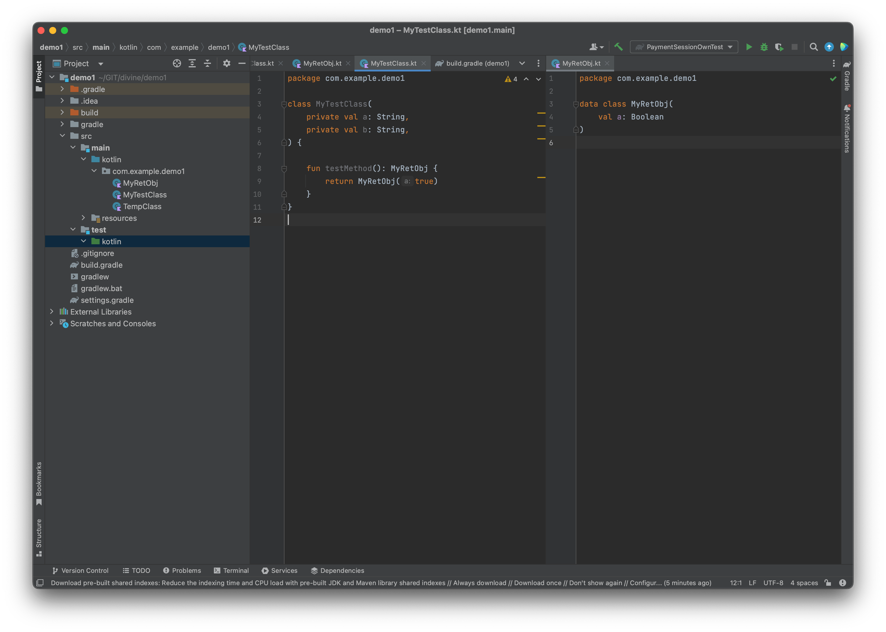
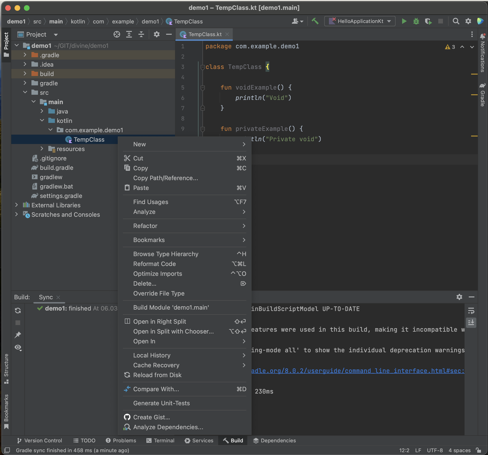
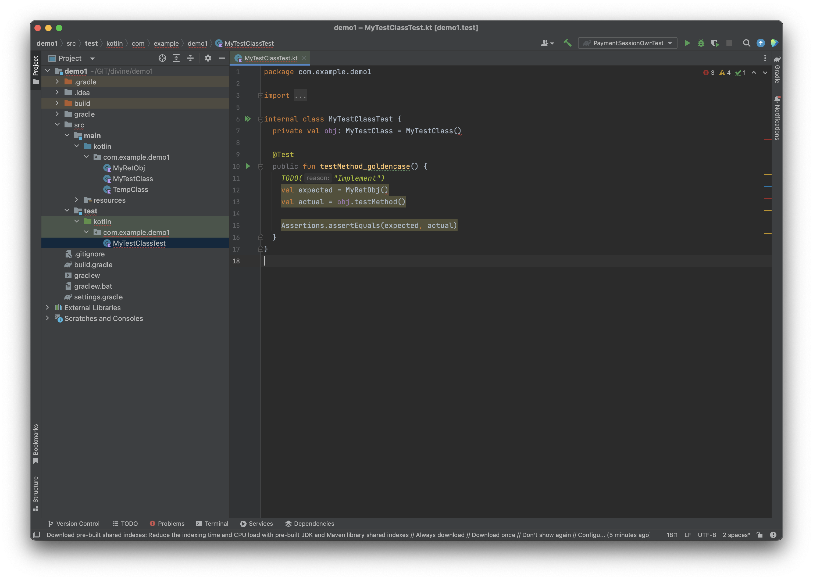

<br>

[](https://www.apache.org/licenses/LICENSE-2.0)

# UTGen Kotlin IDEA IDE plugin

Simple tool for generating unit-test for Kotlin code. 
Based on [UTGen library](https://github.com/divinenickname/utgen-kotlin-core).

## Features
- Supported language: Kotlin.
- Generate stub unit-tests.

## How to use
1. Find your code.
2. Right click on kotlin file.
3. Choose "Generate Unit-Tests".
4. You can find test in test folder.





### Example

Your source class is:
```kotlin
package com.example.demo1

class MyTestClass(
    private val a: String,
    private val b: String,
) {

    fun testMethod(): MyRetObj {
        return MyRetObj(true)
    }
}
```
```kotlin
data class MyRetObj(
    val a: Boolean
)
```

Library generates code:
```kotlin
package com.example.demo1

import org.junit.jupiter.api.Assertions
import org.junit.jupiter.api.Test

internal class MyTestClassTest {
    private val obj: MyTestClass = MyTestClass()

    @Test
    public fun testMethod_goldencase() {
        TODO("Implement")
        val expected = MyRetObj()
        val actual = obj.testMethod()

        Assertions.assertEquals(expected, actual)
    }
}
```
